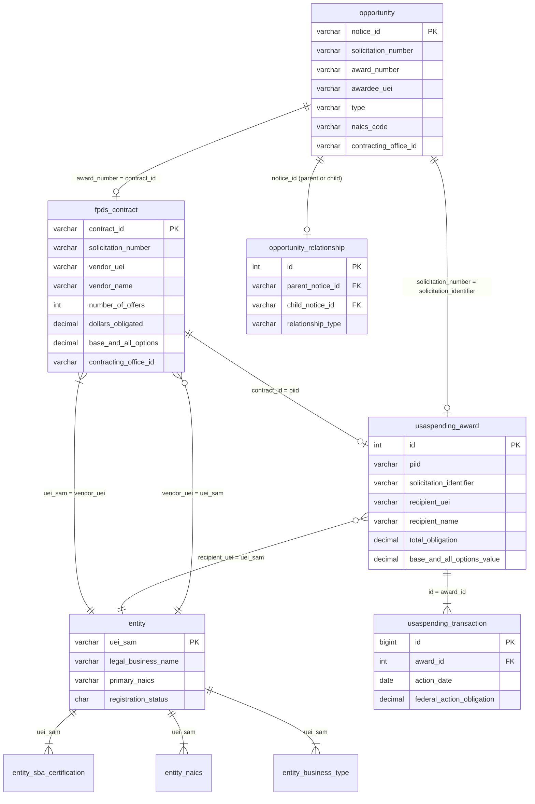

# Data Architecture - Procurement Intelligence Linking Chain

## 1. Purpose

This document maps the federal procurement lifecycle to the database schema, showing how tables link together and which data sources answer common intelligence questions. It saves AI agents and developers from exploring the full schema — read this file to know where every data point lives.

---

## Schema Ownership

The 62 current tables are split between two schema management systems. Both share the single `fed_contracts` database. All tables are defined in Python DDL files for initial creation, but EF Core owns migrations for the 18 application tables.

| Owner | Count | Tables |
|-------|-------|--------|
| **Python DDL** (`fed_prospector/db/schema/`) | 44 | `entity`, `entity_address`, `entity_business_type`, `entity_disaster_response`, `entity_history`, `entity_naics`, `entity_poc`, `entity_psc`, `entity_sba_certification`, `stg_entity_raw`, `opportunity`, `opportunity_history`, `opportunity_relationship`, `fpds_contract`, `federal_organization`, `gsa_labor_rate`, `sam_exclusion`, `sam_subaward`, `usaspending_award`, `usaspending_transaction`, `usaspending_load_checkpoint`, `etl_load_log`, `etl_load_error`, `etl_data_quality_rule`, `etl_rate_limit`, `etl_health_snapshot`, `data_load_request`, `stg_opportunity_raw`, `stg_fpds_award_raw`, `stg_usaspending_raw`, `stg_exclusion_raw`, `stg_fedhier_raw`, `stg_subaward_raw`, `ref_business_type`, `ref_country_code`, `ref_entity_structure`, `ref_fips_county`, `ref_naics_code`, `ref_naics_footnote`, `ref_psc_code`, `ref_sba_size_standard`, `ref_sba_type`, `ref_set_aside_type`, `ref_state_code` |
| **C# EF Core Migrations** (Phase 10+) | 18 | `organization`, `app_user`, `prospect`, `prospect_note`, `prospect_team_member`, `saved_search`, `app_session`, `organization_invite`, `contracting_officer`, `opportunity_poc`, `proposal`, `proposal_document`, `proposal_milestone`, `activity_log`, `notification`, `organization_certification`, `organization_naics`, `organization_past_performance` |

**Rules**: Python DDL is authoritative for ETL/data tables (`build-database` creates, `check-schema` validates). EF Core maps those tables as read-only entities (no migrations). EF Core migrations own the 18 application tables. See [Phase 10 Schema Ownership](../phases/10-API-FOUNDATION.md) for the full decision record.

---

## 2. Procurement Lifecycle Linking Chain

```
                    solicitation_number
RFI (presolicitation) ──── ? ────► Solicitation (RFP)
    notice_id (unique)              notice_id (unique)
    type = 'presolicitation'        type = 'solicitation'
    NO LINK FIELD EXISTS            solicitation_number ──┐
                                    award_number ───────┐ │
                                                        │ │
                    ┌───────────────────────────────────┘ │
                    ▼                                     │
            fpds_contract                                 │
                contract_id (PIID) ◄── award_number       │
                vendor_uei                                │
                number_of_offers (bidder count)           │
                dollars_obligated                         │
                solicitation_number ◄─────────────────────┘

            usaspending_award
                piid ◄── contract_id (PIID)
                solicitation_identifier ◄── solicitation_number
                recipient_uei ◄── vendor_uei
                total_obligation
                    │
                    ▼
            usaspending_transaction
                award_id (FK)
                action_date + federal_action_obligation
                (burn rate = sum over time)

            entity (incumbent profile)
                uei_sam ◄── vendor_uei / recipient_uei
                entity_sba_certification (WOSB, 8a status)
                entity_naics, entity_business_type
```

---

## 3. Cross-Table Linking Fields

| From Table | Field | To Table | Field | Notes |
|------------|-------|----------|-------|-------|
| opportunity | award_number | fpds_contract | contract_id | PIID link (post-award only) |
| opportunity | solicitation_number | fpds_contract | solicitation_number | Direct match |
| opportunity | solicitation_number | usaspending_award | solicitation_identifier | Direct match |
| opportunity | awardee_uei | entity | uei_sam | Awardee lookup |
| fpds_contract | contract_id | usaspending_award | piid | PIID match |
| fpds_contract | vendor_uei | entity | uei_sam | Awardee entity |
| usaspending_award | recipient_uei | entity | uei_sam | Incumbent entity |
| usaspending_award | id | usaspending_transaction | award_id | Transaction detail |
| fpds_contract | contracting_office_id | federal_organization | fh_org_id | Org hierarchy (note: may need mapping) |
| opportunity | contracting_office_id | federal_organization | fh_org_id | Org hierarchy |
| opportunity_relationship | parent_notice_id | opportunity | notice_id | Manual RFI-to-RFP link |
| opportunity_relationship | child_notice_id | opportunity | notice_id | Manual RFI-to-RFP link |

---

## 4. Intelligence Question to Data Source Mapping

| Question | Primary Source | Key Fields | Availability | Notes |
|----------|---------------|------------|--------------|-------|
| Award history | `fpds_contract` + `usaspending_award` | contract_id, dollars_obligated, date_signed, modifications | Ad-hoc API call | Search by solicitation_number or PIID |
| Number of bidders | `fpds_contract` | `number_of_offers`, `extent_competed` | Post-award only | N/A for RFIs. Field only populated after contract award. |
| Security clearance | NOT AVAILABLE VIA API | -- | Manual only | Lives in SOW/PWS document attachments on SAM.gov. GSA CALC+ has clearance data on labor rates (inferential only). |
| Burn rate | `usaspending_transaction` | `action_date`, `federal_action_obligation` | Ad-hoc API call | Aggregate by month. Shows obligations (committed), not expenditures (paid). |
| Incumbent info | `usaspending_award` then `entity` | `recipient_uei` then entity profile | Ad-hoc API call | Chain: USASpending finds awardee UEI, SAM Entity gives full company profile + certifications |
| RFI to RFP link | `opportunity_relationship` | `parent_notice_id`, `child_notice_id` | Manual entry only | SAM.gov API has NO relational field. Users must link manually or business provides the solicitation number. |

---

## 5. Known Data Gaps

| Data Point | Why Not Available | Workaround |
|------------|-------------------|------------|
| Security clearance requirements | Not in any SAM.gov, FPDS, or USASpending API field | Check SOW/PWS on SAM.gov manually; GSA CALC+ labor rates have clearance levels (inferential) |
| RFI to RFP linking | SAM.gov Opportunity API has no parent/child fields | Manual linking via `opportunity_relationship` table; or business provides the solicitation number |
| Opportunity description text | `description` field is a URL, not text; full text requires System Account | User visits SAM.gov link; use title + NAICS to infer scope |
| Real-time contract expenditures | Only obligation data (committed $) is public | USASpending transaction timeline shows obligations over time |
| RFP attachments (SOW, PWS) | Requires authenticated download from SAM.gov | User downloads manually from SAM.gov |
| Entity facility clearance | CUI/FOUO data -- requires System Account access | Not available via public API |

---

## 6. Key Views

**`v_procurement_intelligence`** -- Joins opportunity to fpds_contract to usaspending_award for a given solicitation. Returns award history, bidder count, burn rate, incumbent in one query.

**`v_incumbent_profile`** -- Given a UEI, returns entity profile + active SBA certifications + past contract count + total obligated.

---

## 7. API Data Sources for Ad-Hoc Lookups

| API | Client Class | Key Methods | What It Provides |
|-----|-------------|-------------|-----------------|
| SAM Opportunity | `sam_opportunity_client.py` | `search_opportunities(solnum=...)` | Opportunity details, award info |
| SAM Awards (FPDS) | `sam_awards_client.py` | `search_by_solicitation(piid)`, `search_by_awardee(uei)` | Contract awards, bidder count, vendor |
| USASpending | `usaspending_client.py` | `search_incumbent(sol_num)`, `get_award_transactions(id)` | Award amounts, burn rate, incumbent |
| SAM Entity | `sam_entity_client.py` | `get_entity_by_uei(uei)` | Company profile, certifications |
| SAM Exclusions | `sam_exclusions_client.py` | `check_entity(uei)` | Debarment/exclusion status |
| SAM Subaward | `sam_subaward_client.py` | `search_by_prime(uei)` | Subcontractors, teaming partners |
| GSA CALC+ | `calc_client.py` | `search_rates_all(keyword)` | Labor rates with security clearance levels |

---

## 8. Mermaid ERD (Procurement Intelligence Subset)



---

## 9. Architecture Decisions

### Raw Staging Pattern
ALL API sources get `stg_*_raw` tables (store full JSON + load_id + hash). Enables replay/rebuild without re-fetching from APIs. Entity already has this; 6 more raw tables added in Phase 9 (Schema Evolution).

### SAM.gov Opportunity API Scope
- **Public API only** (`/opportunities/v2/search`). No System Account access.
- Public API returns POC data -- extract it into `contracting_officer` + `opportunity_poc` tables.
- **Authenticated Opportunity Management API** (`/prod/opportunity/v1/api/`): NOT available to us (requires System Account + IP whitelisting). Would give full descriptions, attachments, IVL.

### Schema Ownership
- **Python DDL** owns ETL/data tables (44 tables). See `fed_prospector/db/schema/`.
- **EF Core** owns application tables (18 tables: `app_user`, `organization`, `prospect`, `saved_search`, `proposal`, etc.).
